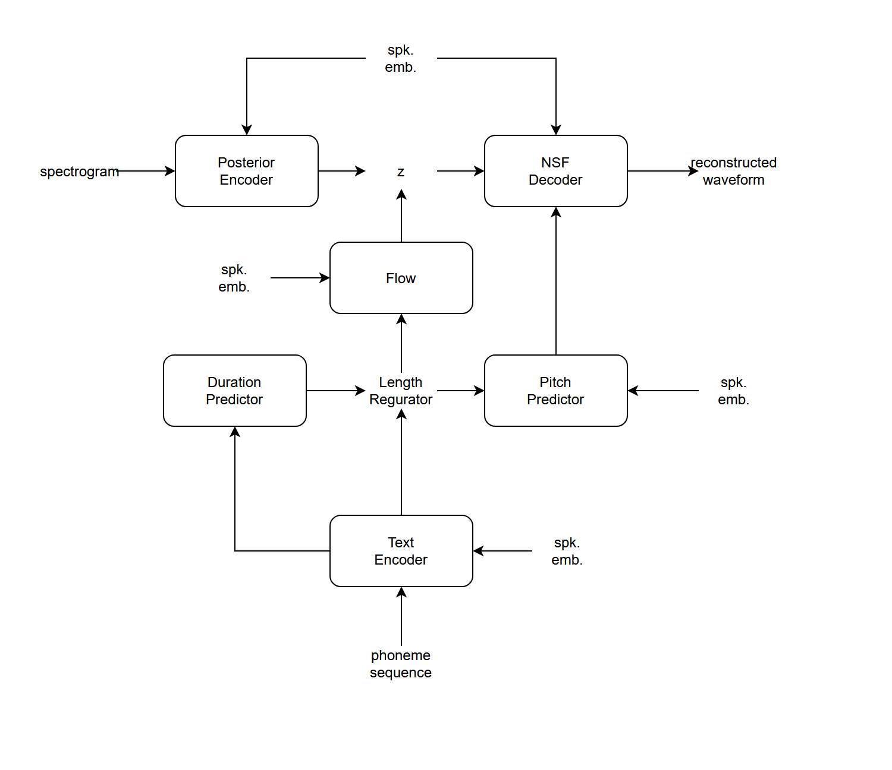

# VITS2P
modified VITS2 for pitch manipulation and quality  
ピッチ制御と品質向上のためのVITS改造  

(現在JVSコーパスにのみ対応。)


# Features
- VITS2
- NSF HiFi-GAN
- SAN Discriminator
- 48kHz
- Multi-Resolution STFT Discriminator


# Usage
1. clone this repo.
```sh
git clone https://github.com/uthree/vits2p/
```

2. install requirements
```sh
pip install -r requirements.txt
```

3. preprocess  
download jvs corpus from https://sites.google.com/site/shinnosuketakamichi/research-topics/jvs_corpus

```sh
python3 preprocess.py jvs jvs_ver1/
```

4. training
```sh
python3 train.py
```

5. check progress
```sh
tensorboard --logdir lightning_logs
```

6. inference
```sh
python3 infer_webui.py
```

# References
- VITS2
    - https://arxiv.org/abs/2307.16430
    - https://github.com/p0p4k/vits2_pytorch/
    - https://github.com/daniilrobnikov/vits2
- SAN
    - https://arxiv.org/abs/2301.12811
    - https://github.com/sony/bigvsan
- NSF-HiFi-GAN
    - https://arxiv.org/abs/1904.12088
    - https://github.com/vtuber-plan/NSF-HiFiGAN
- Multi-Resolution STFT Discriminator form UnivNet
    - https://arxiv.org/abs/2106.07889
    - https://github.com/rishikksh20/UnivNet-pytorch